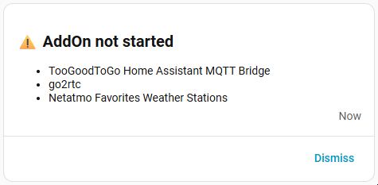

# AddOn Surveillance – Home Assistant Blueprint

This Home Assistant automation blueprint is designed to monitor the *running state* of Home Assistant Add-ons. Its primary purpose is to detect Add-ons that are **not started (state = `off`)** and notify you after a configurable delay.

## ✨ Features
- Monitor Home Assistant Add-ons 🧩
- Detect Add-ons that are **not running** ✅/⛔?
- Send notifications using different methods:
  - Push notification to **all mobile devices** 📣
  - Push notification to **selected mobile devices** 📱
  - **Persistent notification** inside Home Assistant 📑
  - **No notification** (use the blueprint purely as a trigger) 🔕
- Execute **custom actions before and after** notifications ➕
- Apply **custom conditions** to control when notifications should actually fire 🔀

> [!WARNING]
> This blueprint **does NOT check Add-on health**.  
> If an Add-on is technically running but internally broken, this automation can **not** detect the failure. It strictly evaluates the `device_class: running` sensor state.

| Mobile Notification | Persistent Notification |
| ------------------- | ----------------------- |
|  |  |

## 📥 Installation

1. Import the blueprint to your Home Assistant instance:  
   
2. Open your Home Assistant instance and show the blueprint import dialog with a specific blueprint pre-filled.
3. Create a new automation from the imported Blueprint and fill in the required fields.
Adjust optional values or replace the default notification with your own action.

---

## ❤️ Like My Work?
   
Part [My Smart Home Stuff](https://github.com/Flo-R1der/My_Smart-Home_stuff/).