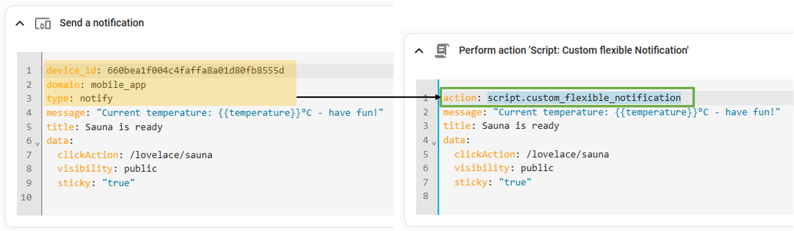
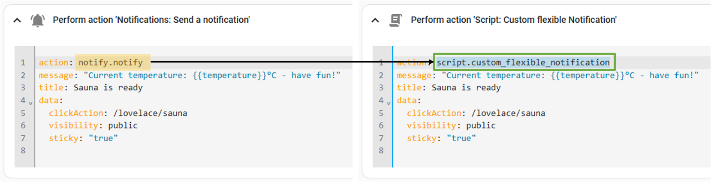

# Custom flexible Notifications

## How does it work?
This Script is a replacement for the `notify.notify` service, but with some considerable extra features, that are solving two main problems:

1. You are getting **Notifications in inconvenient situations**? 
   - Set up zones where you don't want unimportant notifications been delivered and reference them in the blueprint.
      - Examples: work, school, university, gym, ...
   - Once the device leaves the zone, notifications will be delivered as normal
2. **Going on vacation/business trip** and don't want to get notifications?
   - Create a Helper Toggle-Switch*, reference it in the blueprint and turn it off in the Home Assistant User-Interface. This excludes the device from unimportant notifications going through this script.
      - Examples: empty battery, vacuum robot is stuck, dishwasher or washing machine finished, ...
   - Once the Toggle-Switch is turned on again, notifications will be delivered 

\* I know, there is a way to set up this configuration within the blueprint, without the need of creating an `input_boolean`-Helper. But the automation setup is only accessible for Administrators and not for regular users. In order to make it more accessible I decided to use `input_boolean`-Helper.

> **NOTE**: The skipped notifications will NOT be queued and delivered after the person leaves the zone or the Switch is turned on again. This means these notifications will simply be discarded for this device at this moment. Of course the device will be reconsidered in the next run of the script, if the switch is turned on again or th person is not in any excluded zone anymore.

### What about Critical Notifications?
Of course there are some notifications, which should always been delivered. Therefore, additional checks are implemented to **always deliver [Critical notifications](https://companion.home-assistant.io/docs/notifications/critical-notifications/)**, even when:
- [x] The toggle-button is turned off
- [x] The device in in an excluded zone
- [ ] Critical can be sent to ALL DEVICES in Home Assistant (even those, who are not selected for this blueprint)

Critical Notifications can be detected by a couple of identifies. For details about that, please take a look into blueprint options and the official Documentation of the [Companion App](https://companion.home-assistant.io/docs/notifications/notifications-basic). 

 

## How to set up the Blueprint?
1. Import the blueprint to your Home Assistant instance:  

2. Click on **Custom Flexible Notification** (Script) and set up
   - which notifications are allowed to bypass the zone and toggle-button-logic
   - how critical notifications should be identified
   - per device:
      - which device should be notified
      - optional: a Helper Toggle-Switch, to disable the device temporary from the UI
      - a list of zones which should block sending notifications
3. Update your existing automations to use the script-logic instead of selected devices or the notify.notify-service. Here are two examples:
   - 📱 Device replacement example  
   
   - 🔔 `notify.notify` replacement example  
   

## Open Topics
- The Script is well tested with Android Devices. If anyone is finding problems with iOS Devices, feel free to optimize the blueprint and add a Pull-Request.
- As of today (2024-12-14) only the predefined options are implemented, to identify critical notifications. It is planned to do a regex-Logic for notification tags, messegas and title. The Input section is in the blueprint, but the evaluation-logic is missing. shouldn't be a big issue, but i'd rather release it first.
