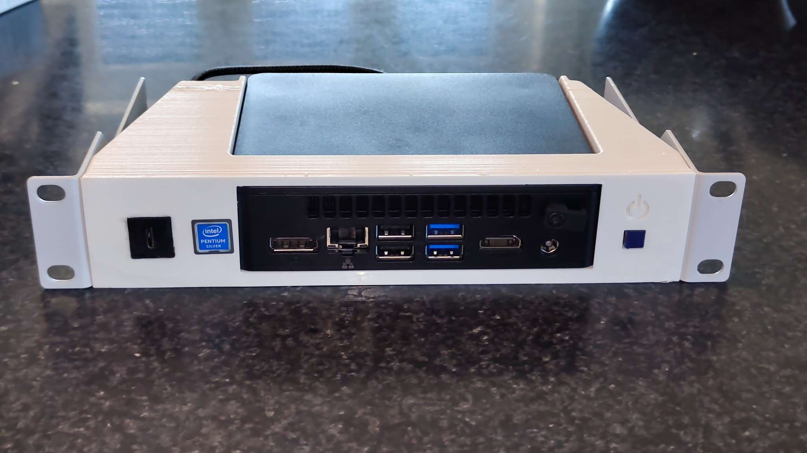
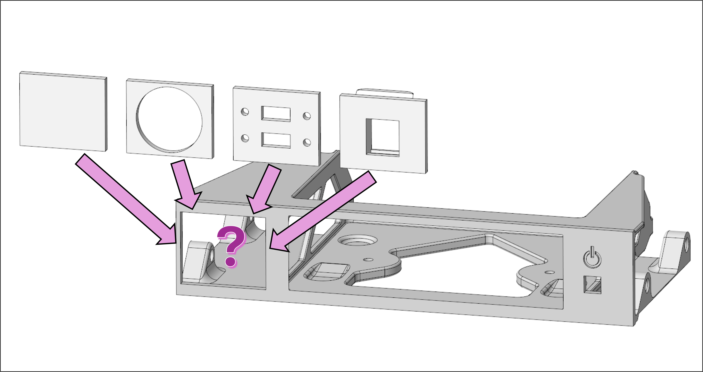
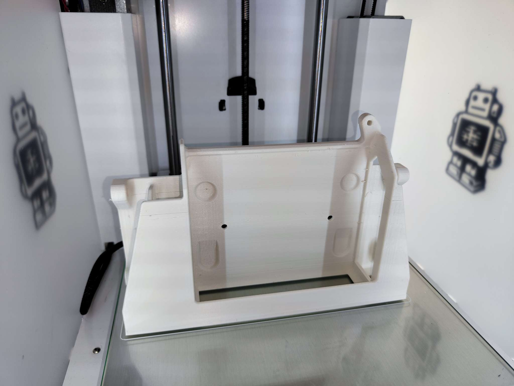
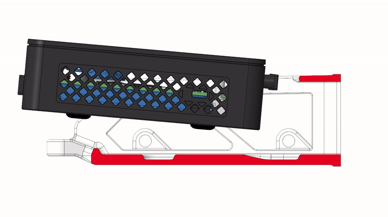
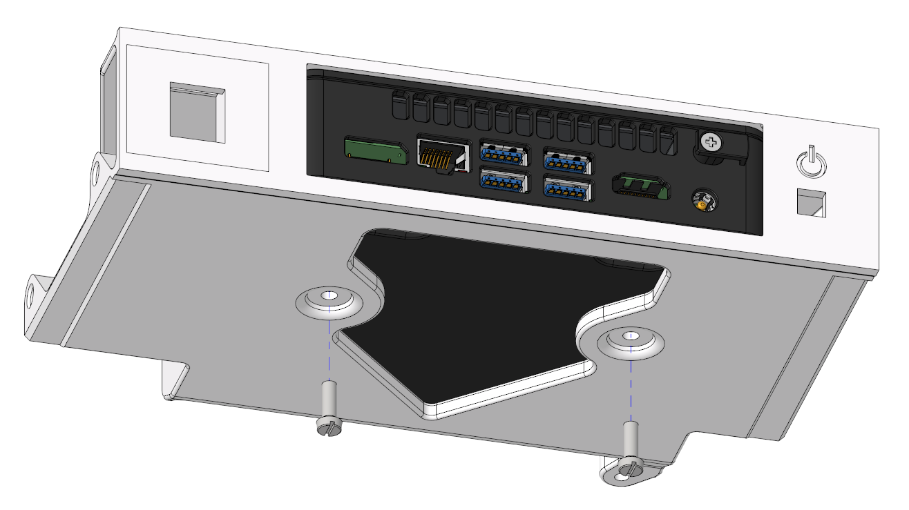
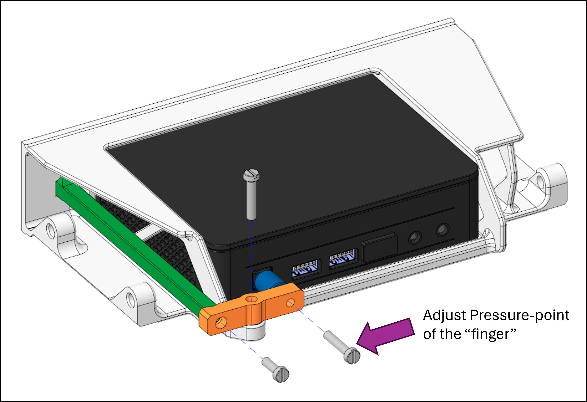
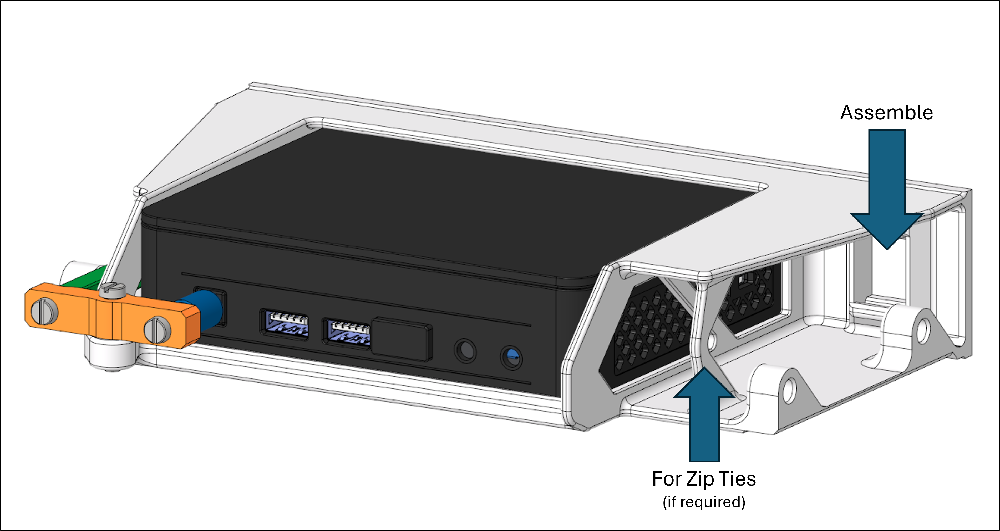
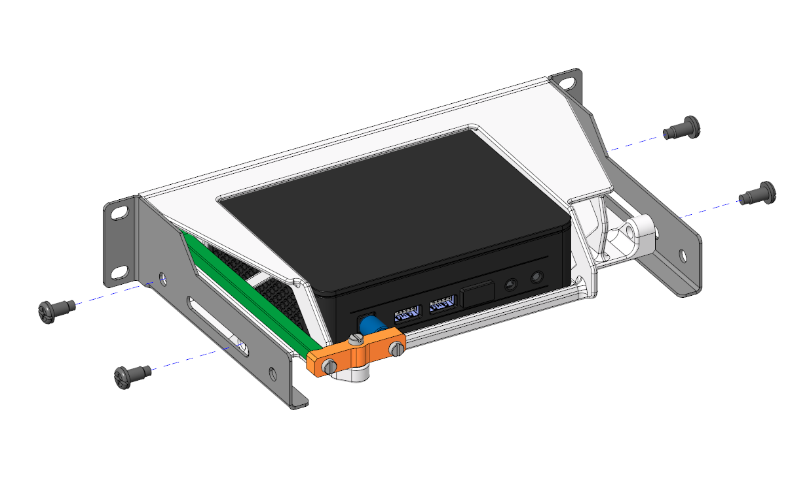
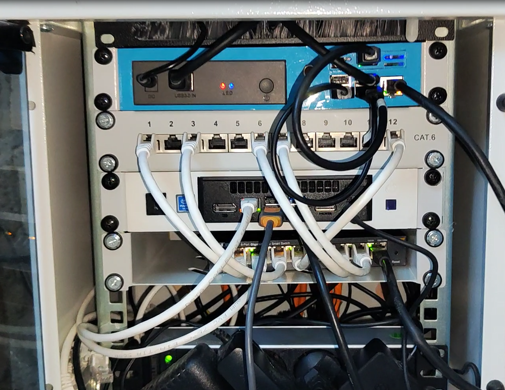

# 3D printed Holder for Intel NUC Gen. 11

I am using an Intel NUC ATKPE Mini-PC for my Proxmox instance and I wanted to fit it into my existing 10" rack. Of course there is no suitable mounting kit available (beside a tray), so i decided to model and print my own mounting kit.

Required/Parts list: 
- 3D-Printer
- mounting-brackets ([Link](https://www.lets-sell.de/netzwerk/lichtwellenleiter-lwl/installation-zubehoer/spleissboxen/zubehoer/19655/19-zoll-montageset-fuer-2-fach-lueftereinheit-grau))
- 8x Rack-Screws (4x side, 4x front)
- 1x Screw M4x12 (lever-pushrod connection)
- 2x Screw M4x20 (lever center + finger)
- optional: Inserts (see decision in Point 1)
- Intel NUC Gen 11 and it's mounting screws

## Printing and Assembling

1. Select the files you need for your project:  

   - Main part is [01_rack-mount_nuc11.stl](01_rack-mount_nuc11.stl)
   - First option is [01a_inlay_no-extras.stl](01a_inlay_no-extras.stl) just to cover the breakthrough
   - Second option is [01b_inlay_30mm-panel-mount.stl](01b_inlay_30mm-panel-mount.stl) if you use a Ø30mm insert (e.g. USB)
   - Third option is [01c_inlay_dual-usb-a.stl](01c_inlay_dual-usb-a.stl) for two USB A sockets
   - Fourth option is [01d_inlay_keystone-module.stl](01d_inlay_keystone-module.stl) for Keystone inserts

2. Do the slicing and printing for your 3D-Printer:  

3. Now you can assemble the Intel NUC:  

4. And tighten it down:  

**Reuse the official Intel NUC mounting screws**

5. Then assemble the lever

Use the highlighted screw to adjust the pressure point for the mechanical finger. Test, if pushing the button from the front panel feels good:
   - On/Off button is pushed permanent: loose the screw
   - Lever and finger can move freely: tighten screw
   - Lever and finger cant move and Pressure-pint feels good: Perfect!

6. Assemble whatever you wanted to have in point 1 (depicted here: keystone module)

7. Assemble the side mounting brackets

Here: rack-screws are used. Depending on the length of your screws, you might shorten them.

8. You're done assembling! 🎉

Please check if everything is working as expected. And don't forget the f**ing sticker! 😆

9. Mount it in your rack and use it

After plugging in the power you can start the device device with a push on the button. Network, USB and HDMI is full accessible. In my case I I also habe an USB-C extra as a keystone insert.

### Have Fun! 🎉

