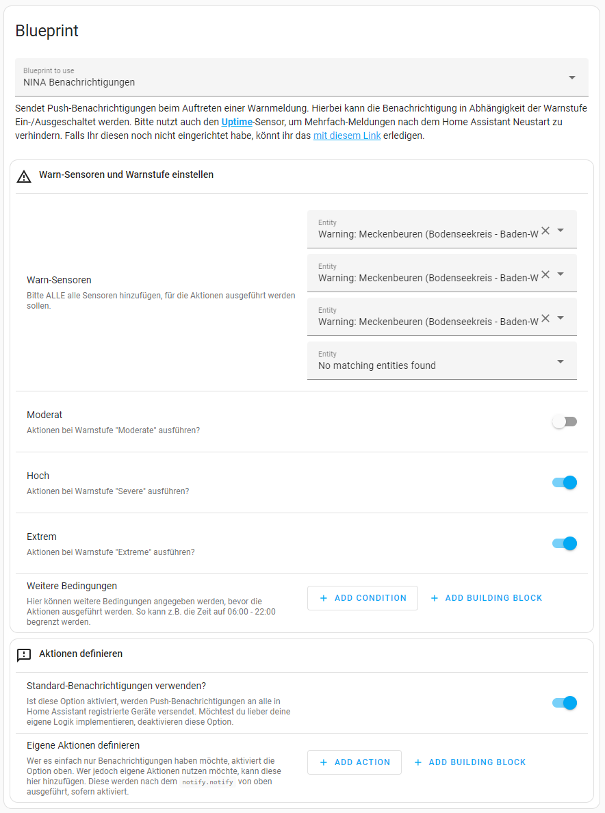
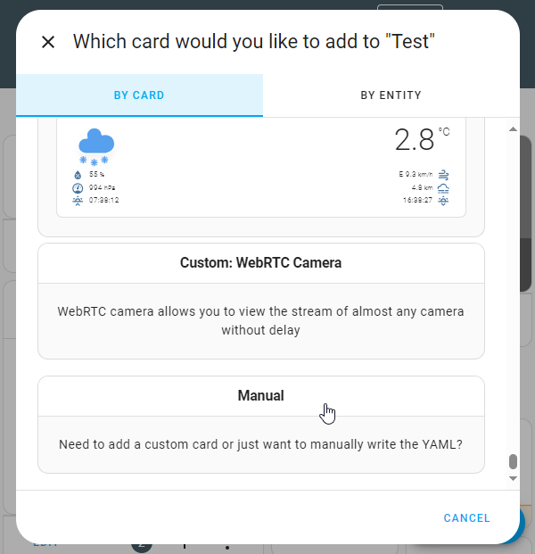
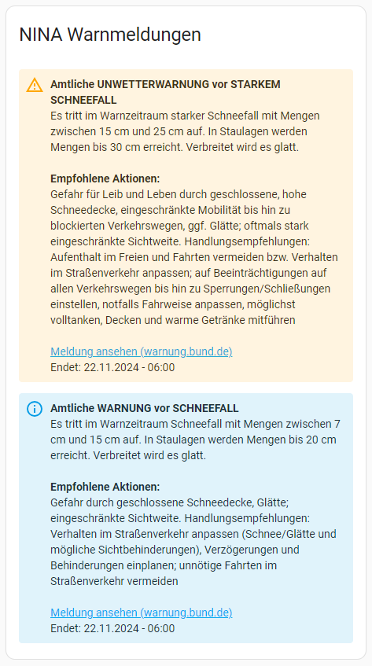
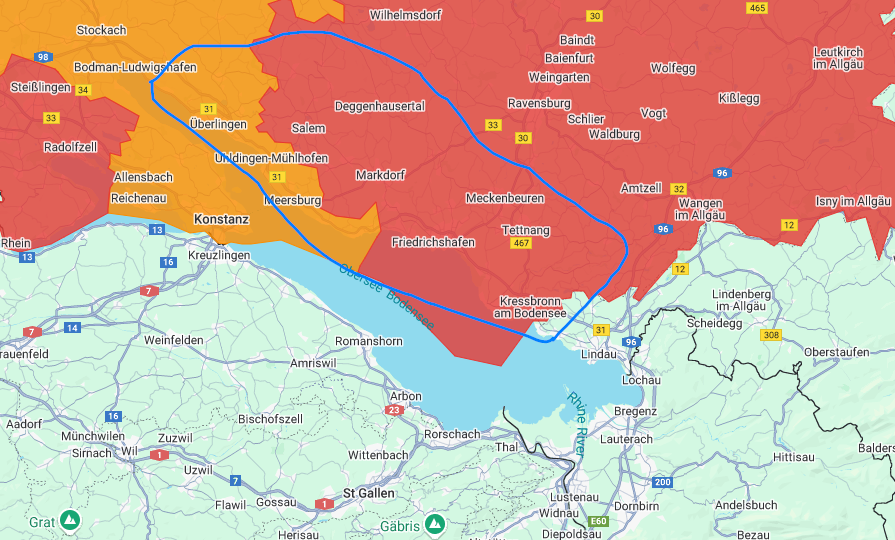

# NINA Warnmeldungen
> [!NOTE]  
> Since [NINA](https://www.home-assistant.io/integrations/nina/) Warnmeldungen is a integration, particularly for Germans provided by the [Bundesamt für Bevölkerungsschutz und Katastrophenhilfe (BBK)](https://www.bbk.bund.de/DE/Warnung-Vorsorge/Warn-App-NINA/Warnung-im-Web/warnung-im-web_node.html), this documentation is written in german. It does not make any sense to me, to keep it international whereas the integration is not. If you want to learn more about NINA, feel free to reach out [Wikipedia](https://de.wikipedia.org/wiki/Warn-App_NINA).

 

In diesem Ordner befindet sich:
1. **Blueprint für Push-Benachrichtigungen**
   - Benachrichtigungen mit Kurzusammenfassung und Direktlink zu der Warnmeldung des BBK.
   - Ein-/Ausschalten der Benachrichtigung in Abhängigkeit des Warnstufe.
   - Verhindert unnötige mehrfach-Meldungen nach dem Neustart von Home Assistant.
   - Die Bedingungen und Aktionen sind frei anpassbar.
      - Damit kann dieser Blueprint auch für andere Zwecke, als das reine Versenden von Benachrichtigungen verwendet werden. Das ist bisher jedoch ungetestet.
2. **YAML-Code für eine NINA Lovelace-Karte via Markdown.**
   - Sammelt die passenden Entitäten automatisch.
   - Zusammenfassung von: Titel, Beschreibung, Empfohlener Aktionen (wenn vorhanden), Direktlink zur Warnung des BBK und Endzeit (wenn vorhanden).
   - Optische einfärbung der Meldungen via [`<ha-alert>`](https://design.home-assistant.io/#components/ha-alert) , gemäß Warnstufe (`Moderate`, `Severe`, `Extreme`).

Natürlich muss für all das die **NINA** Integration eingerichtet sein. Hast du das noch nicht gemacht, kannst du das hier erledigen:  

 

## 1. Automation (Blueprint)
Die Automation an sich ist recht simpel, die Herausforderung liegt im wesentlichen aber in zwei Punkten:
- Nicht alle Warnungen sind es Wert, eine Push-Nachricht auf das Handy zu bekommen. Daher habe ich es in Abhängigkeit der Warnstufe konfigurierbar gestaltet.
- Die passenden Attribute heraus zu schneiden ist auch nicht ganz trivial. Das wird hier aber automatisch in dem Abschnitt `variables:` vorgenommen.

### Voraussetzungen
Damit Blueprint wie erwartet laufen kann, wird der [Uptime-Sensor](https://www.home-assistant.io/integrations/uptime/) genutzt. Dieser verhindert Mehrfach-Meldungen nach dem Home Assistant Neustart. Falls Ihr diesen noch nicht eingerichtet habe, könnt ihr das **[mit diesem Link](https://my.home-assistant.io/redirect/config_flow_start?domain=uptime)** erledigen.

### Blueprint einrichten.
Zu aller erst muss die Voraussetzung von oben erfüllt sein und der Blueprint importiert werden:  
  

Anschließend kann eine neue Automation unter Verwendung des Blueprints erstellt werden. Die Einstellmöglichkeiten sind:
1. **ALLE Warnsensoren** hinzufügen, die Warnmeldungen aus Handy senden sollen  
2. Für die Warnstufen **Moderat**, **Hoch** und **Extrem** kann jeweils entschieden werden, ob Warnungen versendet werden sollen  
3. Bei Bedarf können weitere Bedingungen hinzugefügt werden. Sind diese nicht erfüllt, werden die Aktionen unten nicht ausgeführt. 
4. Standardmäßig versendet der Blueprint eine Benachrichtigung an alle mit der Home Assistant Instanz verbundenen Mobilgeräte, via dem Dienst `notify.notify`. Wer das nicht möchte, deaktiviert den entsprechenden Schalter.
5. Wer den vorigen Schalter deaktiviert hat MUSS eine eigene Aktion definieren. Für alle anderen, gibt es die Möglichkeit weitere Aktionen anzugeben, die nach der Standard-Benachrichtigung ausgeführt werden.

   
Hier ist eine Beispiel-Konfiguration hinterlegt
  
   

 

## 2. Benutzeroberfläche "Warnkarte" (Lovelace)
Für die Benutzeroberfläche gibt es viele Ansätze und es sind auch einige gute in dem zugehörigen **Home-Assistant Community Thread [Getting Started with NINA Integration](https://community.home-assistant.io/t/getting-started-with-nina-integration/388468)** dokumentiert. Dennoch möchte ich hier meinen Ansatz dokumentieren, der gerne 1:1 kopiert werden kann. Dieser funktioniert tatsächlich ohne Anpassungen, sofern die Voraussetzungen erfüllt sind.

### Voraussetzungen
Zur Darstellung nutze ich die [lovelace-auto-entities](https://github.com/thomasloven/lovelace-auto-entities)-Card, welche einfach und unkompliziert die passenden Entitäten sammelt. So können jederzeit weitere Gebiete oder mehr Sensoren hinzugefügt werden, ohne jedes mal die Karte anpassen zu müssen.  
Installiert wird diese am besten über [Home Assistant Community Store (HACS)](https://www.hacs.xyz/docs/use/), alternativ [manuell gemäß dieser Beschreibung](https://github.com/thomasloven/hass-config/wiki/Lovelace-Plugins).

### Karte einrichten
1. Voraussetzungen von oben sicherstellen
2. Zum passenden Dashboard wechseln
3. Neue Karte hinzufügen; am einfachsten über die Option "Manuell".  
    

    
Hier öffnen für Screenshot
  
    
    

4. Kopiert Ihr den Inhalt meiner [lovelace.yaml](lovelace.yaml) in die sich öffnende Eingabemaske (alles ersetzen).
5. Überlegt Ihr euch, ob Ihr mein `exclude`-Filter zu den Vorwarnungen beibehalten möchtet. Wenn nicht, den Abschnitt einfach löschen.
6. Ergebnis kontrollieren. Ich weiß, dafür müssen auch Warnungen anstehen. Zur Not könnt ihr auf der [Warnkarte des BBK](https://warnung.bund.de/meldungen) einen passenden Landkreis auswählen und diesen temporär zu Testzwecken zu eurem Home Assistant hinzufügen.  

#### Warum werden manchmal zwei Warnungen angezeigt?
Ja, das kommt leider immer wieder vor. Für die technisch interessierten gibt es Erklärung und eine Verbesserung in dem [Issue #83992](https://github.com/home-assistant/core/issues/83992).  
Wem das zu hoch ist und lieber eine einfache Erklärung möchte: Die Warnmeldungen werden auf Kreis-Ebene erstellt und von der Integration abgeholt. Ist ein Kreis von zwei Meldungen betroffen, versucht die Integration diese anhand bestimmter Kriterien raus zu filtern, das hat aber seine Grenzen.

In dem Beispiel oben waren schlicht zwei Meldungen für den Bodenseekreis vorhanden.
  

> **Tipp:** Nutzt die [Affected Area Filter](https://www.home-assistant.io/integrations/nina/#affected-area-filter) der Integration, um Falschmeldungen zu reduzieren. Hat in dem Fall oben zwar auch nicht geholfen, das ist aber so selten geworden, dass es verschmerzbar ist. Und wer sich mir Regex schwer tut, nutzt einfach die Website [regex101](https://regex101.com/) oder mein Beispiel und passt es sich an:  
`.*Meckenbeuren.*|.*Schussen.*|.*Bodensee.*|.*weitere.*|.*Württemberg.*|.*eutschland.*` (Das `D` fehlt mit Absicht, weil sonst "Süddeutschland" kein Match wäre)

