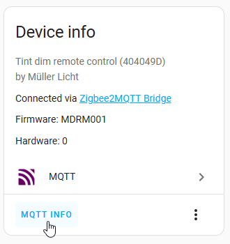

# 🎚️ Muller Licht Remote 404049D – Home Assistant Blueprint

This is a Home Assistant automation blueprint to control lights using the **[Müller Licht 404049D dim remote](https://www.zigbee2mqtt.io/devices/404049D.html)** via **[Zigbee2MQTT](https://github.com/Koenkk/zigbee2mqtt)**. The blueprint utilizes MQTT triggers to handle button presses and provides configuration options for common actions like turning lights on/off, adjusting brightness, and cycling scenes.

> [!IMPORTANT]  
> Will not wok with ZHA. Instead **Zigbee2MQTT** is required for this blueprint to work.

## 🛠️ Configuration

To use this blueprint:

1. Ensure Zigbee2MQTT is set up and publishing MQTT messages. You may check the device logbook for incoming actions in Home Assistant.
2. Note the MQTT topic for the device (e.g., `zigbee2mqtt/muller_licht_remote`).  
   
3. Import the blueprint to your Home Assistant instance:  
   
4. Create a new automation using the blueprint
   - Fill in the MQTT topic and assign actions to each button press

## 📌 Open Topics
- [ ] The automation works fine, but the grouping is not considered yet. If you require to control multiple groups, feel free to optimize the blueprint and add a Pull-Request.

 

---

## ❤️ Like My Work?
  
Part [My Smart Home Stuff](https://github.com/Flo-R1der/My_Smart-Home_stuff/).
