```mermaid
flowchart LR
    A@{ shape: brace-r, label: "Temperature (°C)<br>Humidity (%)" }
    B("Absolute Humidity (g/m³)")
    C@{ shape: text, label: "Input Sensor Values" }
    A -- Sensors --> B -. Attributes .- C
```

# Ventilation Recommendation

**When ventilation actually makes sense?**  
This project provides a set of **Home Assistant [template](https://www.home-assistant.io/integrations/template/#using-blueprints) blueprints** that help you decide when ventilation actually makes sense.  
- Calculate absolute humidity 💧 based on existing sensor values
- Estimate the potential humidity improvement 📈
- Get clear ventilation recommendation 🚦
- Reduce indoor humidity effectively 📉
- Avoid unnecessary heat loss ❄️
- For data-driven automations for smart and efficient airing decisions 🔀

---

## 1. Calculate the Absolute Humidity 💧

This one is the most basic sensor. It simply calculates the absolute humidity based on Temperature (°C) and relative Humidity (%). 

Can be used for statistics 📊 or as trigger for automation ⚙️. The Input values are also available as attributes:



<details><summary><strong>Setup</strong></summary>

To set up this sensor, you need to do two things:
1. Import this Blueprint  
[](https://my.home-assistant.io/redirect/blueprint_import/?blueprint_url=https%3A%2F%2Fgithub.com%2FFlo-R1der%2FMy_Smart-Home_stuff%2Fblob%2Fmain%2Fventilation-recomentation%2Fabsolute-humidity.yaml)
2. Add one ore multiple sensors to your `configuration.yaml` (or `template.yaml`):

```yaml
template:
  - use_blueprint:
      path: Flo-R1der/absolute-humidity.yaml
      input:
      temperature: #weather-station-or-forecast-or-room-temperature
      relative_humidity: #weather-station-or-forecast-or-room-humidity
  name: Absolute Humidity #outside-or-room-name
  unique_id: absolute_humidity_ #outside-or-room-name
```
Obviously you need to fill the correct entity-id for each input sensor. You can set up one sensor for each area you want to track (outside, living room, bedroom, bath, ...).


</details>

---

## 2. Calculate the Potential Humidity Improvement 📈

This sensor compares the inside and outside Temperature (°C) and relative Humidity (%) to calculate the theoretical improvement.

Can be used for statistics 📊 or as trigger for automation ⚙️. The Input values are also available as attributes:



```mermaid
flowchart LR
    D@{ shape: brace-r, label: "Inside Temperature (°C)<br>Inside Humidity (%)
    Outside Temperature (°C)<br>Outside Humidity (%)" }
    E("Potential Humidity Improvement (%)")
    F@{ shape: text, label: "Input Sensor Values in/out
    Absolute humidity in/out
    Potential humidity (%)" }
    D -- Sensors --> E -. Attributes .- F
```

This is done in three steps:
1. Calculates the outside absolute humidity
2. Calculates the theoretical humidity with the air from outside
3. Subtracts the calculate humidity from the measured humidity. Result = this sensor value


<details><summary><strong>Setup</strong></summary>

To set up this sensor, you need to do two things:
1. Import this Blueprint  
[](https://my.home-assistant.io/redirect/blueprint_import/?blueprint_url=https%3A%2F%2Fgithub.com%2FFlo-R1der%2FMy_Smart-Home_stuff%2Fblob%2Fmain%2Fventilation-recomentation%2Fpotential-humidity-improvement.yaml)
2. Add one ore multiple sensors to your `configuration.yaml` (or `template.yaml`):

```yaml
template:
  - use_blueprint:
      path: Flo-R1der/potential-humidity-improvement.yaml
      input:
        outside_temperature: #weather-station-or-forecast
        outside_humidity: #weather-station-or-forecast
        inside_temperature: #room-temperature
        inside_humidity: #room-humidity
    name: Potential Humidity Improvement #room-name
    unique_id: potential_humidity_improvement_ #room-name
```
Obviously you need to fill the correct entity-id for each input sensor. You can set up one sensor for each room you want to track (living room, bedroom, bath, ...).


</details>

---

## 3. Ventilation Recommendation 🚦

This sensor compares the inside and outside Temperature (°C) and relative Humidity (%) to calculate the theoretical improvement and directly give an advice if ventilation is recommended or not.

Can be used as trigger for automation ⚙️ or as an traffic light system 🚦 to inform users via UI or any external lights. The Input values are also available as attributes:

```mermaid
flowchart LR
    G@{ shape: brace-r, label: "Inside Temperature (°C)<br>Inside Humidity (%)
    Outside Temperature (°C)<br>Outside Humidity (%)" }
    H@{ shape: brace-r, label: "Minimum Improvement (%)
    Humidity Threshold (%)" }
    I("Ventilation Recommendation (yes/no)")
    J@{ shape: text, label: "Input Sensor Values in/out
    Absolute humidity in/out
    Potential humidity (%)
    Potential improvement (%)
    Above indoor threshold?
    Above min improvement?" }
    G -- Sensors --> I -. Attributes .- J
    H -- User Input --> I
```



<details><summary>Setup</summary>

To set up this sensor, you need to do two things:
1. Import this Blueprint  
[](https://my.home-assistant.io/redirect/blueprint_import/?blueprint_url=https%3A%2F%2Fgithub.com%2FFlo-R1der%2FMy_Smart-Home_stuff%2Fblob%2Fmain%2Fventilation-recomentation%2Fventilation-recommendation.yaml)
2. Add one ore multiple sensors to your `configuration.yaml` (or `template.yaml`):

```yaml
template:
  - use_blueprint:
      path: Flo-R1der/ventilation-recommendation.yaml
      input:
        outside_temperature: #weather-station-or-forecast
        outside_humidity: #weather-station-or-forecast
        inside_temperature: #room-temperature
        inside_humidity: #room-humidity
        minimum_improvement_value: 10 #change-if-required
        threshold_room_humidity: 50 #change-if-required
    name: Ventilation Recommendation #room-name
    unique_id: ventilation_recommendation_ #room-name
```
Obviously you need to fill the correct entity-id for each input sensor. Adjust the values for `minimum_improvement_value` and `threshold_room_humidity` if you like. You can set up one sensor for each room you want to track (living room, bedroom, bath, ...).


</details>

