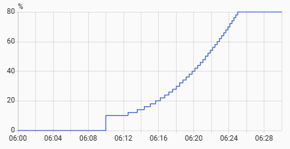

# Wake-up Light with Sunrise Effect

This Home Assistant automation blueprint lets you create a "sunrise simulation" wake-up light using any dimmable light entity. The light gradually increases in brightness between two defined values over a specified time interval.

### ✨ Features & Use Cases
- Gradual brightness increase for a gentle wake-up
- Simulate a natural sunrise in the morning using a smart lamp
- wide variety of triggers (mobile alarm via companion app, schedule entity, manual time or custom trigger) to start the wake-up lighting
- Adjustable transition duration, brightness range, and post-alarm behavior
- proposed settings to only wake you up under certain conditions

 

## 📥 Installation

1. Import the blueprint to your Home Assistant instance:  

2. Create a new automation using this blueprint and configure it to your preferences.

### 🔧 Blueprint Configuration

| Triggers |   |
|----------|---|
| **Alarm Sensor** | A timestamp sensor for the next alarm  |
| **Schedule Entity** | A schedule helper entity to define active time (recommended) |
| **Custom START** / **Custom END** | Time of day, when the light should be turned on or off |
| **Manual Trigger(s)** | Additional triggers (e.g., button press) |

| Conditions |   |
|------------|---|
| **Workday Sensor** | Great to skip the wake-up light on weekends and public holidays |
| **Anyone at Home?** | Obviously, it makes no sense if you don't wake anyone up |
| **Specific Person at Home?** | If the light/room is bound to a specific person |
| **Custom Condition** | Add any other condition you need for your use case |

| Actions and Behavior |   |
|----------------------|---|
| **PRE and POST Actions** | actions you want to perform before or after the sunrise |
| **Target Light** | The light or group to control (dimmable light recommended, but on/off lights also works) |
| **Brightness Values** | Start, End and steps for calculating the parabola |
| **Duration** | Length of the sunrise effect (in minutes) |
| **Start-Point Calculation** | If desired, the sunrise can take place before or after the alarm or half way thru |

## 🚀 Watch the sun rise
Once everything is set up, you will experience a smooth wake up light when you need it:

 

---

## Like My Work?

