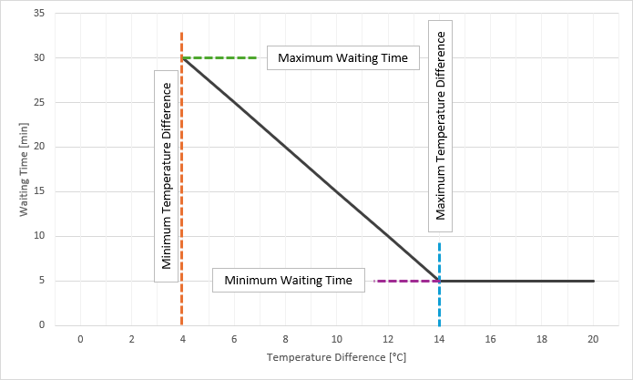

# 🪟 Open Window Notification Blueprint

This Home Assistant **Blueprint** helps you save energy and keep your indoor climate stable by notifying you when a window or door is left open **while the temperature difference between indoors and outdoors is significant**.

It dynamically adjusts the waiting time before a notification is sent — the greater the temperature difference, the faster you’ll be reminded to close the window.


## ✨ Features

- 🪟 **Works with any binary window or door sensor**.  
- 🌡️ **Uses indoor and outdoor temperature sensors** to calculate the temperature difference. 
- ⚙️ **Dynamic waiting time** – automatically adapts based on the temperature difference.  
- 🔔 **Fully customizable actions** – send notifications, announce via Alexa, trigger alarms, or run your own automations.  
- 🔁 **Second action** – optional additional action if the window is still open after the waiting period.  
- ✖️ **Close action** – optional action triggered when the window is closed (e.g. clear a reminder).  
- 🧩 **Beginner-friendly demo action** – includes an example notification using Home Assistant variables.   
- 💬 **Optional tuning parameters** – defaults are provided to start right away.


## 🧠 How It Works

When a window or door is detected as *open*, the Blueprint calculates the temperature difference between your indoor and outdoor sensors. **Based on that difference, it determines a waiting time** before a notification (or any user-defined action) is triggered.  
This makes the system flexible - for example:
- 🌤 warm outside = longer waiting times before notifying you (or no notification)
- ⛄ freezing outside = you will be notified much sooner



<details>
<summary><b>🧩 Example Use Case</b></summary> 

You open your living room window. It’s currently 21 °C inside and 5 °C outside = a 16 °C difference.  
The Blueprint detects this, applies the defined logic, and sends a notification after just a few minutes to remind you that the window is still open.

**Example Notification (default demo action):**
````yaml
service: notify.notify
data:
  title: It's getting cold 🥶
  message: >-
    Window in {{Area}} open for over {{Time}} minutes
    and it's only {{OutsideTemp}}°C outside!
  data:
    tag: "{{ Area }}"
````
>  The `data: tag:` is required, if you want to use the "clear_notification" command, when the window is closed!

You can replace the demo action with any service you like — TTS to your smart speaker, an automation trigger, or even an alarm.
</details>


## 📥 Installation

1. Import the blueprint to your Home Assistant instance: <br>
[](https://my.home-assistant.io/redirect/blueprint_import/?blueprint_url=https://github.com/Flo-R1der/My_Smart-Home_stuff/blob/main/window-notifications/open-window-notifications.yaml)
2. Create a new automation from the imported Blueprint and fill in the required fields.
3. Adjust optional values or replace the default notification with your own action.


## ⚙️ Blueprint Parameters / Inputs

| Parameter                           | Required                         | Description                                                                             |
|-------------------------------------|----------------------------------|-----------------------------------------------------------------------------------------|
| **Window/Door Sensor**              | Yes                              | Binary sensor that detects if a window or door is open.                                 |
| **Indoor Temperature Sensor**       | Yes                              | Sensor providing the current indoor temperature.                                        |
| **Outdoor Temperature Sensor**      | Yes                              | Sensor providing the current outdoor temperature.                                       |
| Minimum Temperature Difference [°C] | No (default: 5 °C)               | The smallest temperature difference that triggers notification logic.                   |
| Maximum Temperature Difference [°C] | No (default: 17.5 °C)            | The largest difference at which the minimum waiting time applies.                       |
| Minimum Waiting Time [min]          | No (default: 5 min)              | The shortest delay before sending a notification.                                       |
| Maximum Waiting Time [min]          | No (default: 30 min)             | The longest delay before sending a notification.                                        |
| Notification Action (primary)       | No (default: see example above)  | Action block executed after the waiting time — customizable by the user.                |
| Second Action                       | No (default: see example above)  | Optional additional action when the window is still open (e.g. reminder, louder alert). |
| Waiting time for second Action      | No (default: 80%)                | The percentage of original waiting time, before the second notification is issued.      |
| Close Action                        | No (default: clear notification) | Action executed when the window is closed (e.g. clear reminders, reset state).          |

> [!TIP]
> Start with the default settings to see how it behaves, then fine-tune the temperature thresholds and waiting times to match your climate and heating habits.


## ❤️ Like My Work?
[](https://ko-fi.com/I3I4160K4Y)   
Part [My Smart Home Stuff](https://github.com/Flo-R1der/My_Smart-Home_stuff/).